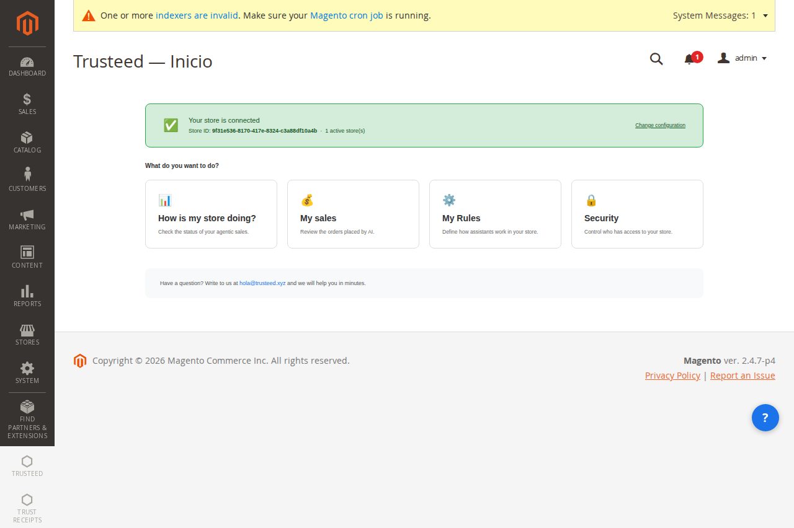
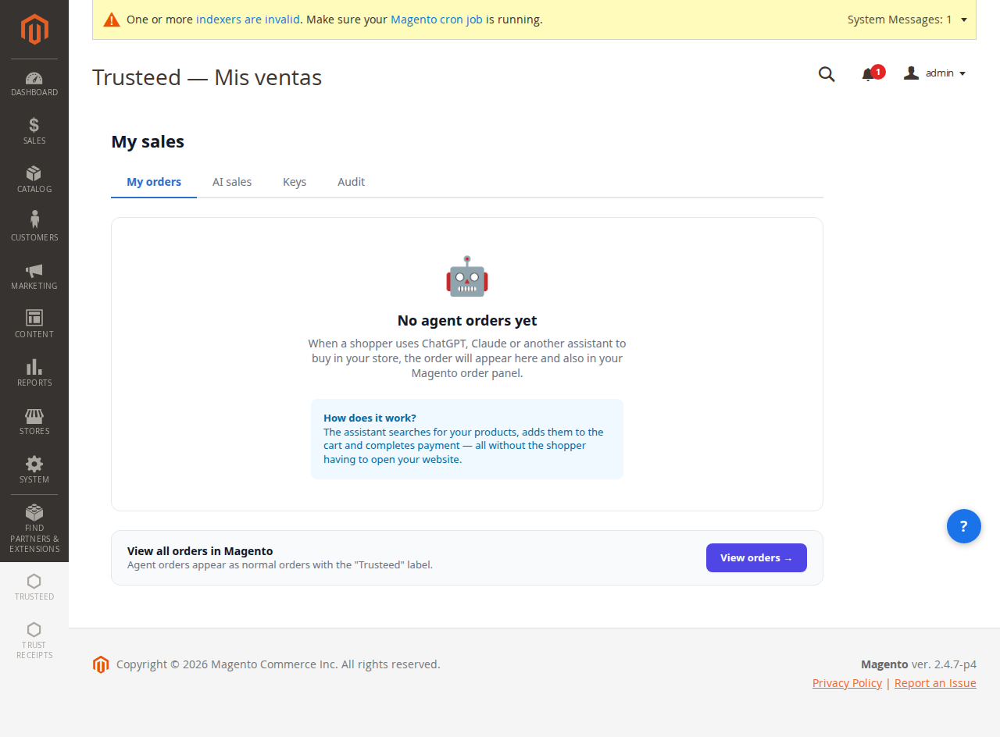
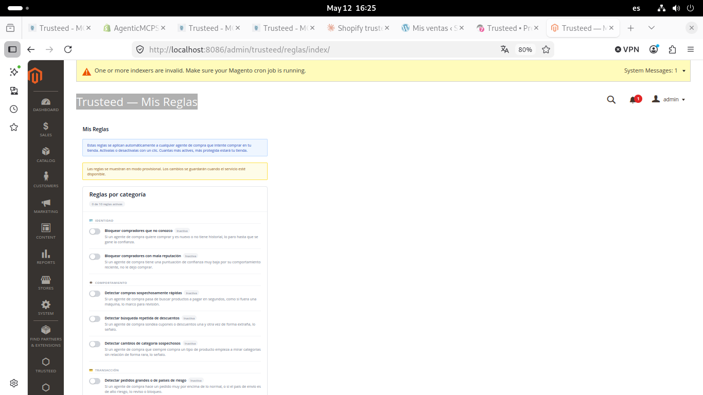
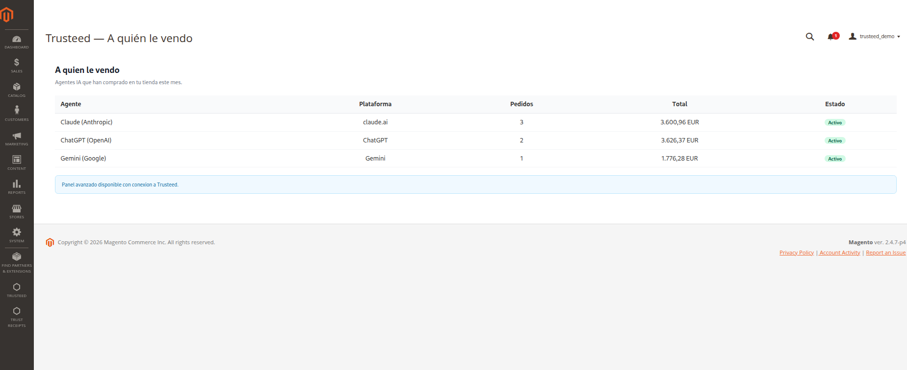
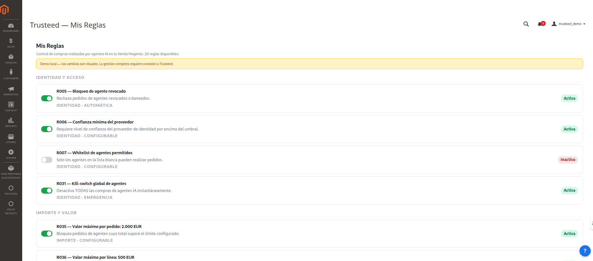
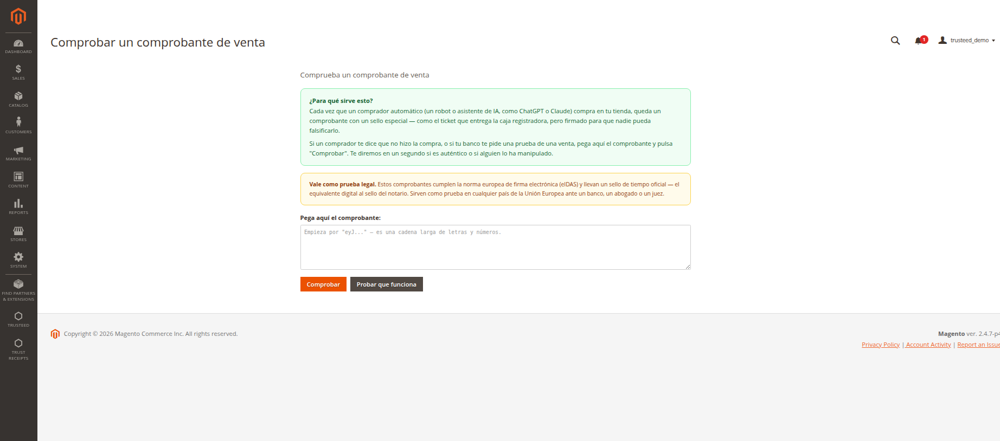
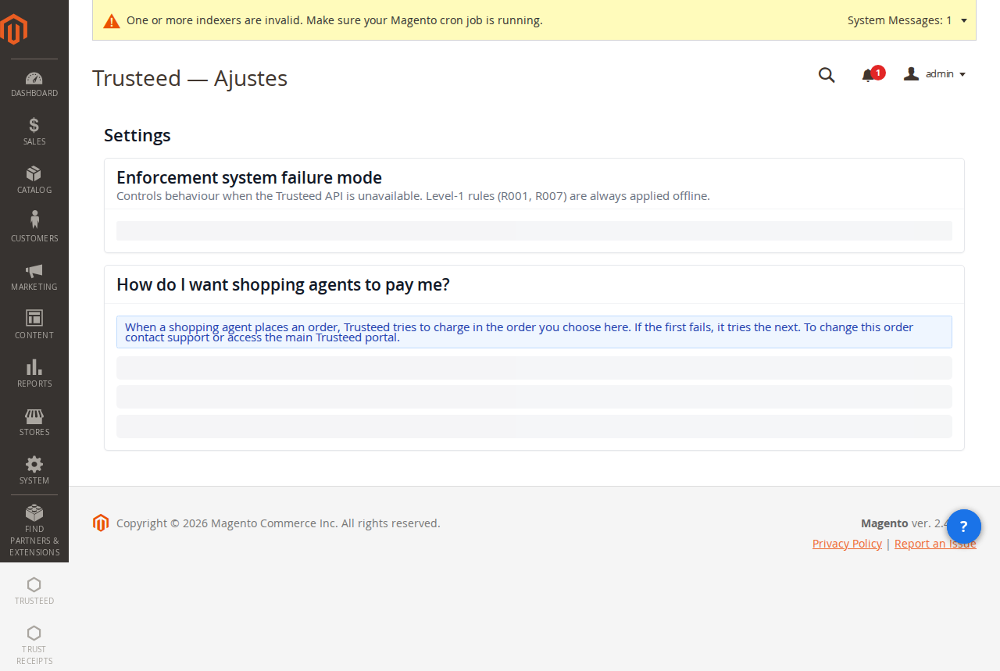
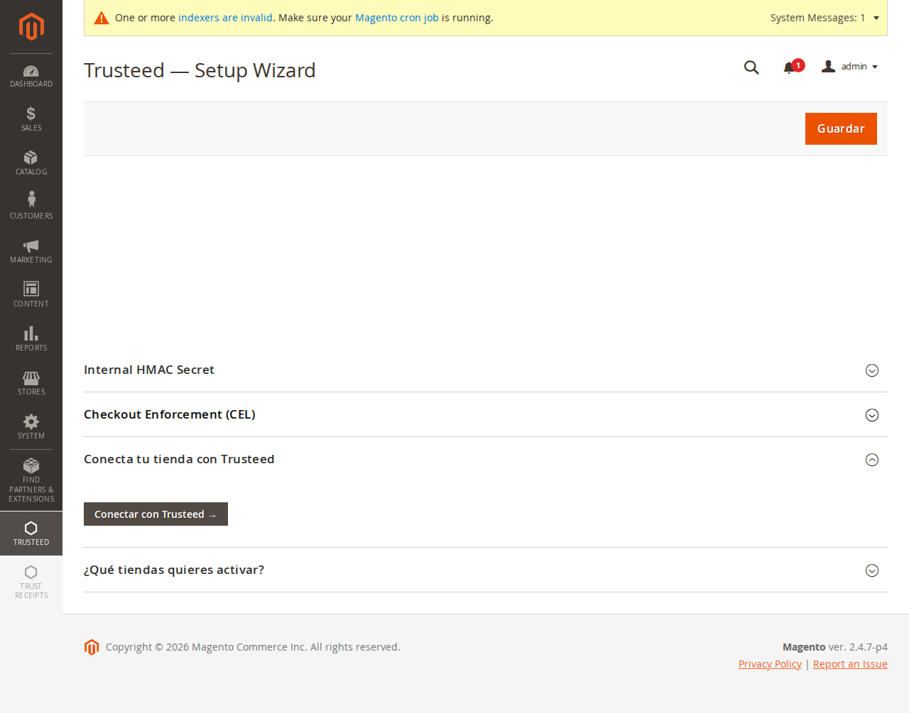
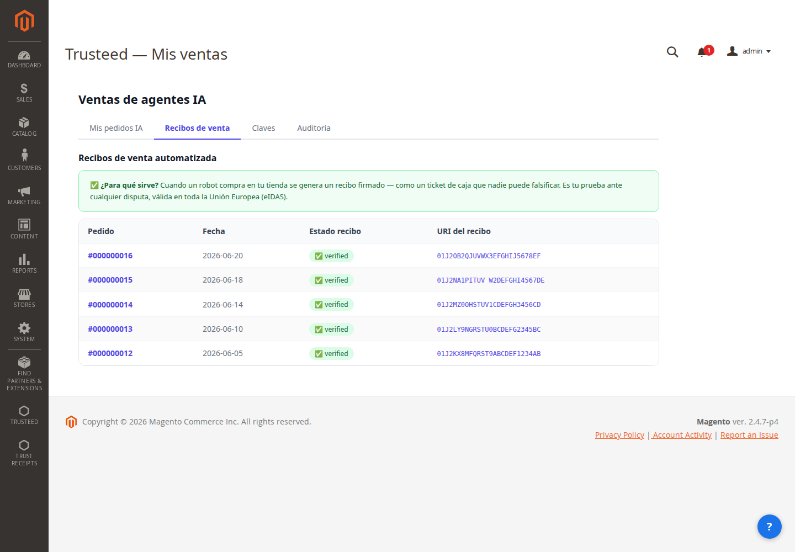

**English** | [Español](README.es.md) | [Français](README.fr.md) | [Deutsch](README.de.md)

# Trusteed Agentic Commerce for Magento 2

Enable new online shoppers, AI agents, to make purchases in your store securely and reliably thanks to Trusteed: the network that fosters trust between businesses and agents.

- **Set your business rules**: who you allow to buy, up to what amount, which categories you don't want to offer to agents, set price limits, maintain stock levels to protect yourself against potential fraudulent agents, and more.
- **Tamper-proof receipts**: we generate electronically signed and cryptographically tamper-proof receipts that serve as proof of the actual transaction in case of any dispute. Compatible with eIDAS (EU, UK) and eSIGN (USA) regulations.
- **Agent analytics**: view statistics on agent purchases — how much they spend, what products they buy, and how often.
- **Agent blocking**: block potentially dangerous or problematic agents.
- **Digital currencies**: enables purchases in digital currencies thanks to the X402 protocol.
- **Peer-to-peer transactions**: enables direct peer-to-peer commerce between agents and merchants.

## Screenshots

| Dashboard | Agent Sales | Business Rules |
|-----------|------------|----------------|
|  |  |  |

| Agents | Rules & Toggles | Trust Receipts |
|--------|----------------|----------------|
|  |  |  |

| Setup Wizard | Setup Config |
|-------------|-------------|
|  |  |

| AI Sales — Automated receipts list |
|--------------------------------------|
|  |

Every agent-originated order gets a signed trust receipt, listed under **Trusteed → Mis ventas → Recibos de venta** with its verification status and receipt URI — link out to the public verifier at `receipts.trusteed.xyz`, or paste the JWS directly into the **Trust Receipts** tool (see above) to check it.

## Features

- **MCP endpoint** at `/.well-known/mcp-manifest.json` — discovered automatically by AI agent platforms
- **Webhook outbox** — reliable order/shipment/refund delivery to the Trusteed backend with automatic retry and backoff
- **Agent token verification** — validates agent identity on every checkout request
- **Enforcement gate (HITL)** — configurable human-in-the-loop approval for high-value agent orders
- **Trust Receipts** — every agent transaction produces a cryptographically signed receipt (Ed25519)
- **Admin dashboard** — SPA showing agent sessions, sales, rules, and health status
- **Audit log** — every agent interaction recorded with identity and verdict

## Compatibility

| Magento version | PHP | Status |
|-----------------|-----|--------|
| Open Source 2.4.7 | 8.2, 8.3 | ✅ Supported |
| Open Source 2.4.8 | 8.2, 8.3 | ✅ Supported |
| Adobe Commerce 2.4.7 | 8.2, 8.3 | ✅ Supported |
| Adobe Commerce 2.4.8 | 8.2, 8.3 | ✅ Supported |

## Requirements

- Magento Open Source or Adobe Commerce 2.4.7+
- PHP 8.2 or 8.3
- A Trusteed account — [sign up free at trusteed.xyz](https://trusteed.xyz)

## Installation

### Via Composer (recommended)

```bash
composer require trusteed/agentic-commerce-magento
bin/magento module:enable Trusteed_AgenticCommerce
bin/magento setup:upgrade
bin/magento setup:di:compile
bin/magento cache:flush
```

### Manual upload

1. **Download the installable `.zip`** from the latest GitHub Release:
   [**⬇ trusteed-agentic-commerce-magento-1.1.1.zip**](https://github.com/Trusteedxyz/agentic-commerce-magento/releases/latest/download/trusteed-agentic-commerce-magento-1.1.1.zip)
   — or browse all versions at the [Releases page](https://github.com/Trusteedxyz/agentic-commerce-magento/releases).
2. Extract to `app/code/Trusteed/AgenticCommerce/`
3. Run the commands above from your Magento root

## Configuration

1. Log in to your Magento **Admin Panel**
2. Go to **Trusteed → Setup Wizard**
3. Enter your **API Key** from [app.trusteed.xyz/settings](https://app.trusteed.xyz/settings)
4. Select the store views you want to expose to AI agents
5. Click **Save & Verify** — the wizard tests connectivity and registers your store

### Advanced settings

Navigate to **Stores → Configuration → Trusteed → Agentic Commerce**:

| Setting | Default | Description |
|---------|---------|-------------|
| API Base URL | `https://api.trusteed.xyz` | Trusteed backend endpoint |
| Webhook secret version | `1` | Rotate after key compromise |
| HITL enforcement mode | `observe` | `observe` logs only; `enforce` blocks orders above threshold |
| HITL amount threshold | `500.00` | Orders above this value require human approval |
| Agent token TTL | `300` | Maximum age (seconds) of a valid agent token |

## Admin Pages

After installation a **Trusteed** menu appears in the Magento admin sidebar:

| Page | Path | Description |
|------|------|-------------|
| Dashboard | Trusteed → Dashboard | Real-time agent session overview |
| Sales | Trusteed → Ventas | Agent-originated orders and receipts |
| Rules | Trusteed → Reglas | Enforcement rules (CEL-based) |
| Agents | Trusteed → Agentes | Connected agent identities |
| Security | Trusteed → Seguridad | Audit log and anomaly alerts |
| Settings | Trusteed → Ajustes | Module configuration |

## Uninstallation

```bash
bin/magento module:disable Trusteed_AgenticCommerce
bin/magento setup:upgrade
composer remove trusteed/agentic-commerce-magento
```

To remove database tables:

```bash
bin/magento setup:db-declaration:generate-whitelist --module-name=Trusteed_AgenticCommerce
# Then manually drop: trusteed_webhook_outbox
# And columns on sales_order: trusteed_receipt_uri, trusteed_receipt_status
```

## Changelog

### 1.2.0

- **Security fix** — the agent token verifier treated `exp`, `iat` and `nonce` as optional. Both time checks hung off `> 0`, so a token that simply omitted the claim skipped expiry and max-age entirely: it was valid forever. All three claims are now mandatory (`nonce` 16–64 chars), matching the canonical token schema and the other platform connectors.
- **Security fix** — the enforcement snapshot's signed freshness window (`validUntil`) was ignored. A snapshot past its window — served by the API or by any intermediary that cached it — was applied as if current. Magento was the only connector that did not check this. An expired snapshot is now treated as absent, so the merchant's fallback policy applies. `validUntil` travels *inside* the signed payload, so it cannot be stretched by an attacker; a missing or unparseable value is not treated as expired, since degrading on an unexpected format would block legitimate checkouts.
- **Fix** — trust scores with a decimal were displayed as "no score". The Health tab parsed the score with `is_int()`, and the scoring engine rounds to one decimal, which `json_decode` maps to a PHP float — so `is_int(81.4)` was `false` and the score silently became `null`. Only whole numbers survived. Measured across production stores on 2026-07-27: scores of 44.7, 52.7, 55.7, 61.5 and 81.4 all rendered as "no score". Now normalised through a single `ScoreNodeNormalizer`, and rendered with the decimal intact (`81.4`, not `81`) so it matches every other admin surface.
- **Fix** — rule R036 (max line-item value) read its cap from a parameter named `maxCents`; the canonical name is `maxCentsPerLine`, and it is the only one the merchant panel's strict schema accepts. With the wrong key the rule could never fire.
- **Added** — the connector now reports which cart signals this installation can project (`POST /api/v1/enforcement/capabilities`, HMAC-signed, sent once per capability-set version). Without it, a rule whose signal never arrives returns `NO_SIGNAL` on every checkout: it passes silently, and the merchant sees a rule in ENFORCE that blocks nothing. With the report, the panel can warn at the moment the rule is switched on. Magento projects 31 signals — more than double any other platform — because it also projects agent history, which elsewhere the server resolves.

### 1.1.1

- **Fix** — the "My Sales → Ventas" page mounted a static placeholder (Dashboard block + `ventas.phtml`) that never reached the actual TrustReceipt list. It now mounts the real admin SPA in the "Mis Ventas" section, same as Rules and Agents.
- Admin SPA bundle rebuilt.

### 1.1.0

- **Fix** — checkout enforcement was skipped entirely for organic (non-agent) checkouts: merchant rules such as maximum order amount, blocked countries, and business-hours restrictions never ran unless an agent DID was present. These rules now apply to every checkout regardless of agent presence.
- **Added** — an offline safety-valve evaluator that enforces the same universal merchant rules locally when the remote rules-evaluation API is unreachable, instead of only falling back to a blanket allow/block policy.
- **Security fix** — the enforcement snapshot fetched from the Trusteed backend is now cryptographically verified (Ed25519 signature check against the published JWKS) before being trusted, instead of being decoded without verification.
- **Security fix** — `EnforcementClient` no longer fabricates a placeholder `dev-bypass` signature when the HMAC secret is not yet configured; requests now fail safely open (`ALLOW`, matching the existing "unconfigured connector never blocks" posture) with a distinct log line so ops can tell an installation mid-setup apart from a fully unconfigured one.
- Fixed the support "Send diagnostics" endpoint calling the wrong backend path (`/api/v1/embed/support/report` → `/v1/embed/support/report`).

### 1.0.0 (2026-06-18)

- Initial release
- MCP manifest endpoint
- Webhook outbox with retry/backoff
- Agent token verification (Ed25519)
- HITL enforcement gate
- Admin SPA dashboard

## Support

- Support email: support@trusteed.xyz
- GitHub issues: [github.com/Trusteedxyz/agentic-commerce-magento/issues](https://github.com/Trusteedxyz/agentic-commerce-magento/issues)

## License

Open Software License 3.0 (OSL-3.0). See [LICENSE](LICENSE) for full text.
