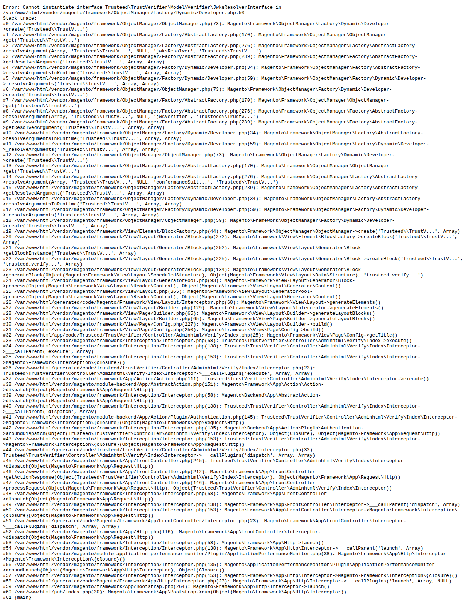

# Trusteed Agentic Commerce for Magento 2

Connect your Magento Open Source or Adobe Commerce store to AI shopping agents via the [MCP protocol](https://trusteed.xyz). Let Claude, ChatGPT, and other AI agents browse your catalog, manage carts, and complete purchases on behalf of customers — with cryptographically signed Trust Receipts for every transaction.

## Screenshots

| Dashboard | Setup Wizard | Agent Sales |
|-----------|-------------|-------------|
|  |  |  |

| Setup Config | Trust Receipts |
|-------------|---------------|
|  |  |

## Features

- **MCP endpoint** at `/.well-known/mcp-manifest.json` — discovered automatically by AI agent platforms
- **Webhook outbox** — reliable order/shipment/refund delivery to the Trusteed backend with automatic retry and backoff
- **Agent token verification** — validates agent identity on every checkout request
- **Enforcement gate (HITL)** — configurable human-in-the-loop approval for high-value agent orders
- **Trust Receipts** — every agent transaction produces a cryptographically signed receipt (Ed25519)
- **Admin dashboard** — SPA showing agent sessions, sales, rules, and health status
- **Audit log** — every agent interaction recorded with identity and verdict

## Compatibility

| Magento version | PHP | Status |
|-----------------|-----|--------|
| Open Source 2.4.7 | 8.2, 8.3 | ✅ Supported |
| Open Source 2.4.8 | 8.2, 8.3 | ✅ Supported |
| Adobe Commerce 2.4.7 | 8.2, 8.3 | ✅ Supported |
| Adobe Commerce 2.4.8 | 8.2, 8.3 | ✅ Supported |

## Requirements

- Magento Open Source or Adobe Commerce 2.4.7+
- PHP 8.2 or 8.3
- A Trusteed account — [sign up free at trusteed.xyz](https://trusteed.xyz)

## Installation

### Via Composer (recommended)

```bash
composer require trusteed/agentic-commerce-magento
bin/magento module:enable Trusteed_AgenticCommerce
bin/magento setup:upgrade
bin/magento setup:di:compile
bin/magento cache:flush
```

### Manual upload

1. Download the `.zip` from the Magento Marketplace
2. Extract to `app/code/Trusteed/AgenticCommerce/`
3. Run the commands above from your Magento root

## Configuration

1. Log in to your Magento **Admin Panel**
2. Go to **Trusteed → Setup Wizard**
3. Enter your **API Key** from [app.trusteed.xyz/settings](https://app.trusteed.xyz/settings)
4. Select the store views you want to expose to AI agents
5. Click **Save & Verify** — the wizard tests connectivity and registers your store

### Advanced settings

Navigate to **Stores → Configuration → Trusteed → Agentic Commerce**:

| Setting | Default | Description |
|---------|---------|-------------|
| API Base URL | `https://api.trusteed.xyz` | Trusteed backend endpoint |
| Webhook secret version | `1` | Rotate after key compromise |
| HITL enforcement mode | `observe` | `observe` logs only; `enforce` blocks orders above threshold |
| HITL amount threshold | `500.00` | Orders above this value require human approval |
| Agent token TTL | `300` | Maximum age (seconds) of a valid agent token |

## Admin Pages

After installation a **Trusteed** menu appears in the Magento admin sidebar:

| Page | Path | Description |
|------|------|-------------|
| Dashboard | Trusteed → Dashboard | Real-time agent session overview |
| Sales | Trusteed → Ventas | Agent-originated orders and receipts |
| Rules | Trusteed → Reglas | Enforcement rules (CEL-based) |
| Agents | Trusteed → Agentes | Connected agent identities |
| Security | Trusteed → Seguridad | Audit log and anomaly alerts |
| Settings | Trusteed → Ajustes | Module configuration |

## Uninstallation

```bash
bin/magento module:disable Trusteed_AgenticCommerce
bin/magento setup:upgrade
composer remove trusteed/agentic-commerce-magento
```

To remove database tables:

```bash
bin/magento setup:db-declaration:generate-whitelist --module-name=Trusteed_AgenticCommerce
# Then manually drop: trusteed_webhook_outbox
# And columns on sales_order: trusteed_receipt_uri, trusteed_receipt_status
```

## Changelog

### 1.0.0 (2026-06-18)

- Initial release
- MCP manifest endpoint
- Webhook outbox with retry/backoff
- Agent token verification (Ed25519)
- HITL enforcement gate
- Admin SPA dashboard

## Support

- Documentation: [docs.trusteed.xyz/magento](https://docs.trusteed.xyz/magento)
- Support email: support@trusteed.xyz
- GitHub issues: [github.com/trusteed/magento-module](https://github.com/trusteed/magento-module)

## License

Open Software License 3.0 (OSL-3.0). See [LICENSE](LICENSE) for full text.
